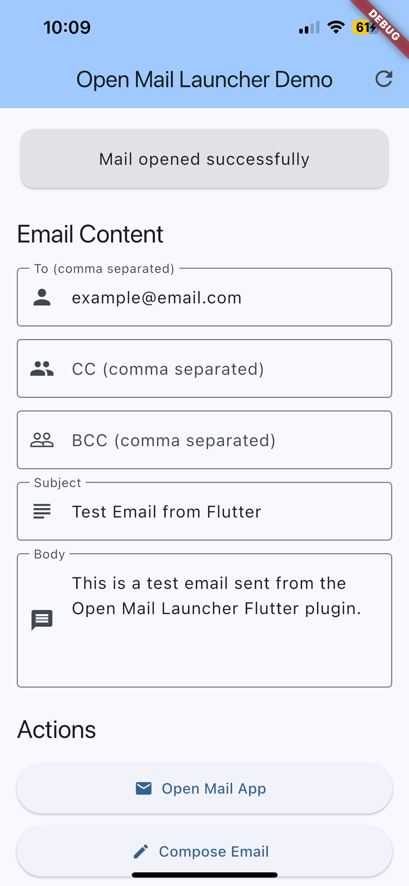
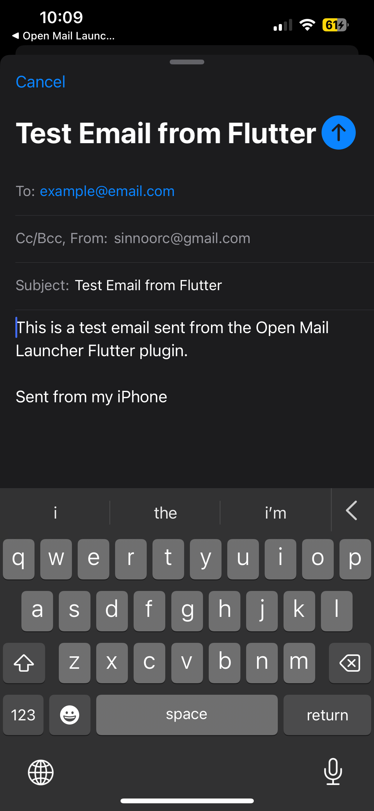

# Open Mail Launcher

[](https://pub.dev/packages/open_mail_launcher)
[](https://flutter.dev)
[](https://flutter.dev)

A Flutter plugin to open email applications on Android and iOS. This plugin allows you to:

- Query for available email apps on the device
- Open the default email app or a specific email app
- Compose emails with pre-filled content (recipients, subject, body)
- Handle multiple email apps with a built-in picker dialog

## Features

✅ **Cross-platform**: Android and iOS support  
✅ **Email app discovery**: Get list of installed email apps  
✅ **Smart app opening**: Automatic handling of single vs multiple apps  
✅ **Pre-filled composition**: Support for To, CC, BCC, subject, and body  
✅ **Attachment support**: File attachments on Android  
✅ **Picker dialog**: Built-in UI for selecting from multiple apps  
✅ **Swift Package Manager**: Full SPM support for iOS (iOS 12.0+)  

## Screenshots

<div align="center">
  
  
</div>

*Left: Open Mail Launcher demo app interface | Right: iOS Mail app with pre-filled content*

## Installation

Add this to your package's `pubspec.yaml` file:

```yaml
dependencies:
  open_mail_launcher: ^0.1.0
```

Then run:

```bash
flutter pub get
```

## Platform Setup

### Android

No additional setup required. The plugin automatically handles email intent queries for Android 11+ compatibility.

### iOS

Add the email app URL schemes you want to query to your `ios/Runner/Info.plist`:

```xml
<key>LSApplicationQueriesSchemes</key>
<array>
    <string>mailto</string>
    <string>googlegmail</string>
    <string>ms-outlook</string>
    <string>ymail</string>
    <string>readdle-spark</string>
    <!-- Add more email app schemes as needed -->
</array>
```

## Usage

### Basic Usage

```dart
import 'package:open_mail_launcher/open_mail_launcher.dart';

// Check if any email app is available
bool available = await OpenMailLauncher.isMailAppAvailable();

// Get list of available email apps
List<MailApp> apps = await OpenMailLauncher.getMailApps();

// Open any available email app
OpenMailAppResult result = await OpenMailLauncher.openMailApp();
```

### Compose Email with Content

```dart
final emailContent = EmailContent(
  to: ['john@example.com', 'jane@example.com'],
  cc: ['manager@example.com'],
  bcc: ['admin@example.com'],
  subject: 'Hello from Flutter!',
  body: 'This email was sent from my Flutter app.',
);

// Compose email in any available app
bool success = await OpenMailLauncher.composeEmail(
  emailContent: emailContent,
);

// Or open with specific app selection
OpenMailAppResult result = await OpenMailLauncher.openMailApp(
  emailContent: emailContent,
);
```

### Handle Multiple Email Apps

```dart
OpenMailAppResult result = await OpenMailLauncher.openMailApp(
  emailContent: emailContent,
);

if (result.didOpen) {
  // Email app opened successfully
  print('Email app opened!');
} else if (result.hasMultipleOptions) {
  // Show picker dialog for multiple apps
  MailApp? selectedApp = await OpenMailLauncher.showMailAppPicker(
    context: context,
    mailApps: result.options,
    title: 'Choose Email App',
  );
  
  if (selectedApp != null) {
    // Open the selected email app
    bool opened = await OpenMailLauncher.openSpecificMailApp(
      mailApp: selectedApp,
      emailContent: emailContent,
    );
  }
} else {
  // No email apps available
  print('No email apps found');
}
```

### Open Specific Email App

```dart
// Get available apps
List<MailApp> apps = await OpenMailLauncher.getMailApps();

// Find and open Gmail specifically
MailApp? gmail = apps.firstWhere(
  (app) => app.name.toLowerCase().contains('gmail'),
  orElse: () => null,
);

if (gmail != null) {
  bool success = await OpenMailLauncher.openSpecificMailApp(
    mailApp: gmail,
    emailContent: emailContent,
  );
}
```

## Models

### EmailContent

Represents the content for composing an email:

```dart
EmailContent(
  to: ['recipient@example.com'],           // List of recipient emails
  cc: ['cc@example.com'],                  // List of CC emails
  bcc: ['bcc@example.com'],                // List of BCC emails
  subject: 'Email Subject',                // Email subject
  body: 'Email body content',              // Email body
  isHtml: false,                          // Whether body is HTML
  attachments: ['path/to/file.pdf'],      // File attachments (Android)
)
```

### MailApp

Represents an email application:

```dart
MailApp(
  name: 'Gmail',                          // Display name
  id: 'com.google.android.gm',           // Package name (Android) or URL scheme (iOS)
  icon: 'base64-encoded-icon',            // App icon (optional)
  isDefault: true,                        // Whether it's the default email app
)
```

### OpenMailAppResult

Result of attempting to open a mail app:

```dart
OpenMailAppResult(
  didOpen: true,                          // Whether an app was opened
  canOpen: true,                          // Whether apps are available
  options: [MailApp(...)],                // List of available apps
  error: null,                            // Error message if any
)
```

## Supported Email Apps

### Android

- Gmail
- Outlook
- Yahoo Mail
- Samsung Email
- Any app that handles `mailto:` intents

### iOS

- Mail (default)
- Gmail
- Outlook
- Yahoo Mail
- Spark
- Airmail
- ProtonMail
- Superhuman
- And many more

## Error Handling

The plugin provides comprehensive error handling:

```dart
try {
  OpenMailAppResult result = await OpenMailLauncher.openMailApp();
  
  if (result.error != null) {
    print('Error: ${result.error}');
  }
} catch (e) {
  print('Exception: $e');
}
```

## Platform Differences

### Android

- Shows native app chooser when multiple apps are available
- Supports file attachments
- Can detect default email app
- Uses package manager to discover apps

### iOS

- Returns list of available apps for manual selection
- URL scheme-based app detection
- Limited to known email app schemes
- No attachment support due to iOS limitations

## Example

See the [complete example app](https://pub.dev/packages/open_mail_launcher/example) on pub.dev or check the [example directory](example/) for a full sample demonstrating all features.

## Contributing

Contributions are welcome! Please feel free to submit a Pull Request.

## License

This project is licensed under the MIT License - see the [LICENSE](LICENSE) file for details.
