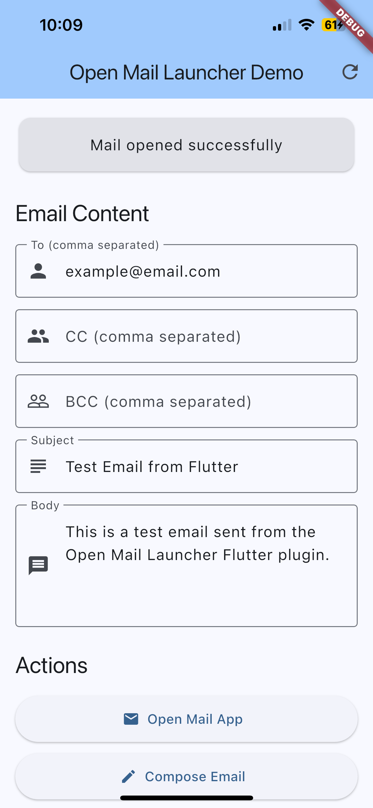
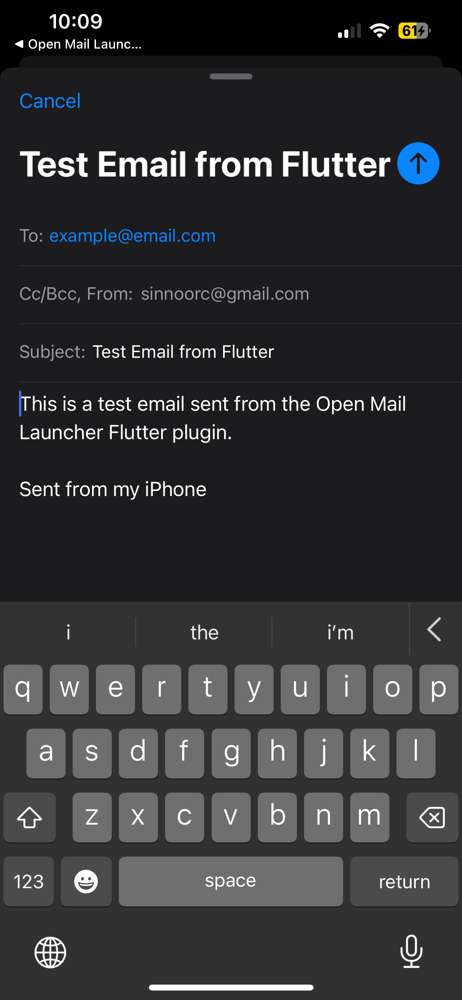

# Open Mail Launcher

[](https://pub.dev/packages/open_mail_launcher)
[](https://flutter.dev)
[](https://flutter.dev)
[](https://github.com/sinnoorc/open_mail_launcher/actions/workflows/main.yml)
[](https://codecov.io/gh/sinnoorc/open_mail_launcher)

A Flutter plugin to open email applications on Android, iOS, macOS, and Linux
(desktop support is in **beta** as of 0.4.0). This plugin allows you to:

- Query for available email apps on the device
- Open the default email app or a specific email app
- Compose emails with pre-filled content (recipients, subject, body)
- Handle multiple email apps with a built-in picker dialog

## Features

✅ **Cross-platform**: Android, iOS, macOS (beta), and Linux (beta)  
✅ **Email app discovery**: Get list of installed email apps  
✅ **Smart app opening**: Automatic handling of single vs multiple apps  
✅ **Pre-filled composition**: Support for To, CC, BCC, subject, and body  
✅ **Attachment support**: Android `content://` URI attachments  
✅ **Picker dialog**: Built-in UI for selecting from multiple apps  
✅ **Swift Package Manager**: Full SPM support for iOS (iOS 13.0+)

## Screenshots

<div align="center">
  
  
</div>

_Left: Open Mail Launcher demo app interface | Right: iOS Mail app with pre-filled content_

## Installation

Add this to your package's `pubspec.yaml` file:

```yaml
dependencies:
  open_mail_launcher: ^0.2.0
```

Then run:

```bash
flutter pub get
```

## Platform Setup

### Android

No additional setup required. The plugin contributes the Android 11+
package-visibility `<queries>` entries it needs through manifest merging.

For attachments, pass Android `content://` URIs that the receiving mail app can
read. Plain file-system paths are not reliable on modern Android and are not
converted by the plugin. If the URI comes from your app's `FileProvider`, grant
read access before launching; the plugin adds the standard read flags to the
outgoing email intent.

### iOS

iOS detects mail apps by probing URL schemes with `canOpenURL`. Each scheme must
be declared in your app's `ios/Runner/Info.plist` under `LSApplicationQueriesSchemes`.
**Schemes that are not declared are silently treated as "not installed"**, even
when the app is actually present — this is the #1 cause of "works in debug, fails
in release" for this kind of plugin.

Add the full set the plugin probes:

```xml
<key>LSApplicationQueriesSchemes</key>
<array>
    <string>mailto</string>
    <string>message</string>
    <string>googlegmail</string>
    <string>ms-outlook</string>
    <string>ymail</string>
    <string>readdle-spark</string>
    <string>airmail</string>
    <string>fastmail</string>
    <string>superhuman</string>
    <string>protonmail</string>
    <string>hey</string>
    <string>canarymail</string>
    <string>spike</string>
    <string>polymail</string>
    <string>bluemail</string>
    <string>edison</string>
</array>
```

iOS limits `LSApplicationQueriesSchemes` to a hard maximum of **50 entries**
per app — listing all 16 above leaves 34 slots free for other features.

If you don't care about a specific mail app, you can omit its scheme to keep
your plist smaller — detection for that app will return `false` regardless of
whether it's actually installed.

### macOS (beta)

No setup required. Mail apps are discovered through Launch Services
(`NSWorkspace`) — every installed `mailto:` handler is found, with no
scheme allowlist. `MailApp.id` is the app's bundle identifier.

### Linux (beta)

No setup required. Mail apps are the registered `x-scheme-handler/mailto`
handlers (the same list `xdg-mime` consults). `MailApp.id` is the app's
`.desktop` file id. Note: if **your** app ships as a Flatpak or Snap, the
sandbox may hide the host's installed mail apps.

## Usage

### Basic Usage

```dart
import 'package:open_mail_launcher/open_mail_launcher.dart';

// Check if any email app is available
bool available = await OpenMailLauncher.isMailAppAvailable();

// Get list of available email apps
List<MailApp> apps = await OpenMailLauncher.getMailApps();

// Open any available email app
OpenMailAppResult result = await OpenMailLauncher.openMailApp();
```

### Compose Email with Content

```dart
final emailContent = EmailContent(
  to: ['john@example.com', 'jane@example.com'],
  cc: ['manager@example.com'],
  bcc: ['admin@example.com'],
  subject: 'Hello from Flutter!',
  body: 'This email was sent from my Flutter app.',
);

// Compose email in any available app
bool success = await OpenMailLauncher.composeEmail(
  emailContent: emailContent,
);

// Or open with specific app selection
OpenMailAppResult result = await OpenMailLauncher.openMailApp(
  emailContent: emailContent,
);
```

### Handle Multiple Email Apps

```dart
OpenMailAppResult result = await OpenMailLauncher.openMailApp(
  emailContent: emailContent,
);

if (result.didOpen) {
  // Email app opened successfully
  print('Email app opened!');
} else if (result.hasMultipleOptions) {
  // Show picker dialog for multiple apps
  MailApp? selectedApp = await OpenMailLauncher.showMailAppPicker(
    context: context,
    mailApps: result.options,
    title: 'Choose Email App',
  );

  if (selectedApp != null) {
    // Open the selected email app
    bool opened = await OpenMailLauncher.openSpecificMailApp(
      mailApp: selectedApp,
      emailContent: emailContent,
    );
  }
} else {
  // No email apps available
  print('No email apps found');
}
```

### Open Specific Email App

```dart
// Get available apps
List<MailApp> apps = await OpenMailLauncher.getMailApps();

// Find and open Gmail specifically
MailApp? gmail;
for (final app in apps) {
  if (app.name.toLowerCase().contains('gmail')) {
    gmail = app;
    break;
  }
}

if (gmail != null) {
  bool success = await OpenMailLauncher.openSpecificMailApp(
    mailApp: gmail,
    emailContent: emailContent,
  );
}
```

## Models

### EmailContent

Represents the content for composing an email:

```dart
EmailContent(
  to: ['recipient@example.com'],           // List of recipient emails
  cc: ['cc@example.com'],                  // List of CC emails
  bcc: ['bcc@example.com'],                // List of BCC emails
  subject: 'Email Subject',                // Email subject
  body: 'Email body content',              // Email body
  isHtml: false,                          // Whether body is HTML
  attachments: ['content://...'],         // Android content URI attachments
)
```

Android attachments must be readable `content://` URIs. The plugin does not
turn plain paths such as `/sdcard/file.pdf` into shareable content URIs.

### MailApp

Represents an email application:

```dart
MailApp(
  name: 'Gmail',                          // Display name
  id: 'com.google.android.gm',           // Package name (Android) or URL scheme (iOS)
  icon: 'base64-encoded-icon',            // App icon (optional)
  isDefault: true,                        // Whether it's the default email app
)
```

### OpenMailAppResult

Result of attempting to open a mail app:

```dart
OpenMailAppResult(
  didOpen: true,                          // Whether an app was opened
  canOpen: true,                          // Whether apps are available
  options: [MailApp(...)],                // List of available apps
  error: null,                            // Error message if any
)
```

## Supported Email Apps

### Android

- Gmail
- Outlook
- Yahoo Mail
- Samsung Email
- Any app that handles `mailto:` intents

### iOS

- Mail (default)
- Gmail
- Outlook
- Yahoo Mail
- Spark
- Airmail
- ProtonMail
- Superhuman
- And many more

### macOS & Linux (beta)

- Any installed app registered as a `mailto:` handler — no hardcoded list

## Error Handling

The plugin provides comprehensive error handling:

```dart
try {
  OpenMailAppResult result = await OpenMailLauncher.openMailApp();

  if (result.error != null) {
    print('Error: ${result.error}');
  }
} catch (e) {
  print('Exception: $e');
}
```

## Platform Differences

### Android

- Shows native app chooser when multiple apps are available
- Opens the mail app's inbox (not a compose window) when no `emailContent` is passed
- Supports `content://` URI attachments
- Can detect default email app
- Uses package manager to discover apps

### iOS

- Returns list of available apps for manual selection
- Opens the app itself (not a compose window) when no `emailContent` is passed — except the synthesized "Default Mail App" entry, which iOS can only open via `mailto:`
- URL scheme-based app detection
- Limited to known email app schemes
- No attachment support due to iOS limitations

### macOS (beta)

- Full mail app enumeration via Launch Services (names, icons, real default)
- `openMailApp()` opens the system default mail app directly (no picker needed —
  macOS always has an authoritative default)
- No `emailContent` opens the app itself; with content a compose window opens
- No attachment support (`mailto:` cannot carry attachments)

### Linux (beta)

- Mail app enumeration via `x-scheme-handler/mailto` (GIO); icons are not
  provided (`MailApp.icon` is null)
- `openMailApp()` opens the system default handler directly
- No `emailContent` opens the app itself; with content a compose window opens
- No attachment support (`mailto:` cannot carry attachments)

## Example

See the [complete example app](https://pub.dev/packages/open_mail_launcher/example) on pub.dev or check the [example directory](example/) for a full sample demonstrating all features.

## Contributing

Contributions are welcome! Please check out the [Usage Guide](CONTRIBUTING.md) for details on how to contribute. Feel free to submit a Pull Request.

## License

This project is licensed under the MIT License - see the [LICENSE](LICENSE) file for details.
